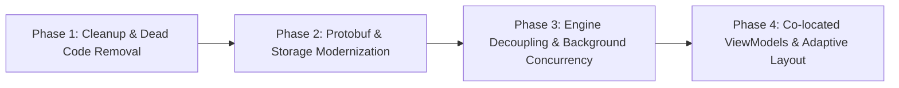

# Architecture & Technical Roadmap

This document outlines the agreed architectural design, modernization roadmap, and explicit conscious decisions for the **GamiAutoClicker** solution (including `EasyWindows` and `GamiToolkit`).

---

## 1. Assembly Boundaries & API Design

### Project Roles & Relationships
- **`EasyWindows`**:
  - **Purpose**: Low-level window lifecycle orchestration, custom title bar management, and system backdrop (Mica / Acrylic) adaptation.
  - **Boundary**: Explicitly does **not** handle saving/persisting settings and provides no theme modification UI controls. It strictly lifts WinUI windowing and system backdrops up by one clean layer of abstraction.
- **`GamiToolkit`**:
  - **Purpose**: A shared library providing cross-app coordination and common modules across all Gami suite applications.
  - **Boundary**: Builds on top of `EasyWindows`. Hosts cross-app features such as theme settings serialization, shared configuration paths, and future reusable UI components (e.g., common Appearance pages, color picker flyouts).
- **`GamiAutoClicker`**:
  - **Purpose**: The desktop application consuming `EasyWindows` and `GamiToolkit`.

### Naming & Namespaces (Conscious Decision)
- **Class vs Namespace**: We intentionally retain the static entry-point class named `EasyWindows` so calling code uses `EasyWindows.CreateWindow(...)`.
- **Top-Level Types**: To eliminate compiler warnings regarding nested types (`CA1034`), all options models and enums (`WindowOptions`, `BackdropMaterial`, `ThemeSettings`, `ButtonOptions`) will reside as top-level types directly in namespace `Gami.EasyWindows`. Both the class and types share this namespace.
- **Window Identifiers**: `CreateWindow<TKey>(TKey key) where TKey : notnull` will be used instead of raw `object` parameters. This allows consumers complete flexibility to use enums, strings, or records while preserving type safety and forbidding null keys.

### Protobuf Serialization & Native AOT (Conscious Decision)
- **Format**: Protobuf is deliberately chosen as the cross-application, language-standard serialization format.
- **Library**: `protobuf-net` will be replaced with **`Google.Protobuf`** combined with `Grpc.Tools` (or `Google.Protobuf.Tools`) integrated into MSBuild.
- **Build Integration**: `.proto` definitions are placed in `Protos/` and compiled during `dotnet build` automatically by `protoc`. This guarantees 100% Native AOT compatibility (no Reflection.Emit) and provides zero-cost serialization performance.

---

## 2. State Management & Persistence Lifecycle

### Complete Decoupling of `ClickEngine` (Conscious Decision)
- `ClickEngine` must have **zero awareness** of the UI layer, `GeneralSettings`, or `Localization`.
- It will no longer poll `GeneralSettings.IsEditing`.
- Instead, `ClickEngine` will expose simple control properties such as `public bool IsPaused { get; set; }` (or explicit `Pause()` / `Resume()` methods).
- When a user enters key recording or settings interaction, the UI explicitly pauses the engine; the engine never queries UI state.

### In-Memory vs Disk Persistence Lifecycle (Conscious Decision)
- **Startup**: Settings are loaded into memory from disk.
- **Live Interaction**: Sliders, toggle switches, and comboboxes immediately alter live in-memory properties so the user can see/test changes in real time.
- **Window Closing**: Closing the settings window does **not** discard or roll back in-memory settings. The current session preserves whatever values the user selected.
- **Saving to Disk**: Changes are written to disk **only** when the user explicitly clicks the **Save** button.

---

## 3. Concurrency, Hotkeys & High-Resolution Timing

### Dedicated Background Thread
- The click execution loop will run off the UI dispatcher on a dedicated high-priority background thread (`ThreadPriority.Highest`).
- The UI thread is relieved of all high-frequency execution timers. Events intended for UI notification (`ClickingFailed`, state transitions) will be marshaled through `DispatcherQueue.TryEnqueue`.

### Global Input Interception
- Hotkey detection will transition away from tight `GetAsyncKeyState` polling loops.
- Input monitoring will use low-level Windows hooks (`SetWindowsHookEx` with `WH_KEYBOARD_LL` and `WH_MOUSE_LL`) to capture mouse buttons (`XButton1`, `XButton2`) and keyboard events globally without requiring application focus.

### High-Resolution Timer Resolution
- Windows default timer scheduling (~15.6 ms) will be bypassed to achieve accurate, high-CPS clicking rates.
- The engine will leverage `CreateWaitableTimerExW` configured with `CREATE_WAITABLE_TIMER_HIGH_RESOLUTION` (or `timeBeginPeriod(1)`) to achieve accurate sub-millisecond wait intervals without CPU-intensive busy spinning.

### Mouse Click Dwell Time (Known Item)
- Currently, `ClickEngine` sends mouse down and up in a single `SendInput` batch. While currently functional, some target games/apps drop instantaneous clicks. Adding a configurable dwell duration between press and release is noted for future implementation.

---

## 4. UI Architecture & ViewModels

### Co-Located ViewModels (Conscious Decision)
- Full enterprise MVVM with separate files/assemblies is rejected in favor of **co-located ViewModels**.
- The ViewModel class will reside inside the **same code-behind file** (e.g., `MainViewModel` in `MainWindow.xaml.cs`).
- **Elimination of `_isSynchronizing`**: Property updates and calculations (e.g., Interval Delay $\leftrightarrow$ Clicks Per Second) are handled within the ViewModel via change notifications (`INotifyPropertyChanged`), allowing clean `{x:Bind Mode=TwoWay}` in XAML. This eliminates manual event subscription, bi-directional event loops, and synchronization flags.

### Declarative Responsive Layout
- Imperative `SizeChanged` event handlers calculating pixel widths and moving controls in C# code will be replaced with standard WinUI 3 XAML `VisualStateManager` and `AdaptiveTrigger`.

### Visual Tree Modifications
- **NumberBox Delete Button**: The manual tree-traversal hack (`RemoveClearButton`) will be replaced with native XAML styling / template overrides once validated.
- **SplitView / NavigationView**: Investigation into pure XAML configuration (`PaneDisplayMode="LeftCompact"`) to replace visual tree traversal for inline mode.
- **Transparency Checkerboard**: Kept as-is for now (lifted from Windows Community Toolkit).

---

## 5. Storage Directory Standards (Conscious Decision)

- All configurations will target the `~/.config` convention in the user profile:
  - **App-Specific Settings**:
    `%USERPROFILE%\.config\gami\autoClicker\`
  - **Shared Settings (Theme, etc.)**:
    `%USERPROFILE%\.config\gami\shared\`
- Legacy `%LOCALAPPDATA%` paths and abandoned `language.txt` files will be decommissioned.

---

## 6. Testing & Housekeeping

- **Test Harness**: The embedded integration script in `tests/ReloadVerification.cs` is obsolete and will be removed.
- **Repository Cleanup**:
  - Remove empty `Styles/` directory.
  - Remove empty `Constants` class.
  - Clean up untracked package build artifacts (`AppPackages/`, `BundleArtifacts/`).
  - Maintain clean, descriptive commit messages.

---

## 7. Execution Phases

1. **Phase 1: Housekeeping & Dead Code Removal**
   - Delete `tests/ReloadVerification.cs`, empty `Styles/` directory, and empty `Constants` class.
   - Clean up untracked artifacts.
2. **Phase 2: Google.Protobuf & Storage**
   - Migrate `GamiToolkit` from `protobuf-net` to `Google.Protobuf` + `Grpc.Tools` MSBuild integration.
   - Align storage paths to `%USERPROFILE%\.config\gami\...`.
3. **Phase 3: ClickEngine & Concurrency**
   - Move click execution loop to a dedicated background thread.
   - Decouple `ClickEngine` from `GeneralSettings` (implement `IsPaused`).
   - Introduce low-level hooks (`WH_KEYBOARD_LL`, `WH_MOUSE_LL`) and high-resolution timer.
4. **Phase 4: UI Architecture & Declarative Layout**
   - Introduce co-located `MainViewModel` in `MainWindow.xaml.cs` to eliminate `_isSynchronizing`.
   - Implement `AdaptiveTrigger` for responsive layouts in settings pages.
